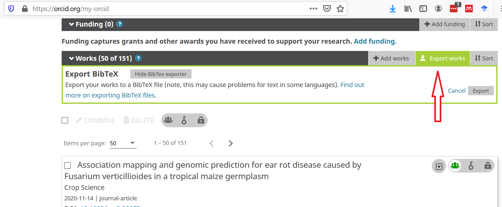

# Make-author-list-for-Conflict-of-Interest-or-Collaborators-and-Affiliations-List

Updated 3/18/2021

I need to make conflict of interest/collaborator and affiliation lists for NSF and other government grant proposals. It's really a pain because I have A LOT of co-authors. So I wrote some python code to automate at least getting the list of co-author names.

1. Go to your personal ORCID page and browse to section "Works". You can download all of those to a bibtex file:

2. Install bibtexparser package: >pip install bibtexparser
3. Modify the python script [createCOIlist.py](createCOIlist.py) to point to your downloaded file, change the currentYear, change the goBack number of years, and modify the output file path and name at end
4. Run the script, then you can open the resulting file in a text editor or excel
5. Names will be duplicated if they appear as different spellings or formattings (eg, "Smith, John" and "Smith, J." will both be there). I just go through by hand and edit out the duplicates.
6. International character symbols are messed up, have to fix those by hand
7. A few edge cases like "J. Smith, Jr." and "Natalia de Leon" can get messed up, again just have to fix those by hands. 

OLD WAY, left it here just in case, use this file.
WARNING!!! To my sadness I have realized that downloading the references from scholar google does not get all the authors on all papers. If the author list is long, it appears that not all authors are guaranteed to be included in the downloaded citation list. :(

1. Go to scholar google profile page (need to make one if you don't have it already)
2. Click on the Year column header to sort by Year
3. Select all publications in the last 48 months.
4. Click export and select RefMan, this will export a file called 'citations.ris', which you can download.
5. Modify the python script to point to the correct download folder and run it.
6. The script will generation a file called 'references.txt', you can open that and copy/paste into the COI template excel spreadsheet
7. You will need to remove non-identical duplicates (eg, "Smith, John. A" and "Smith, John" will not be seen as duplicates inside the program)
8. Still have to enter the Institution information in the COA spreadsheet by hand. Sorry, I am in a hurry to get this done and don't have time to tackle that problem.
